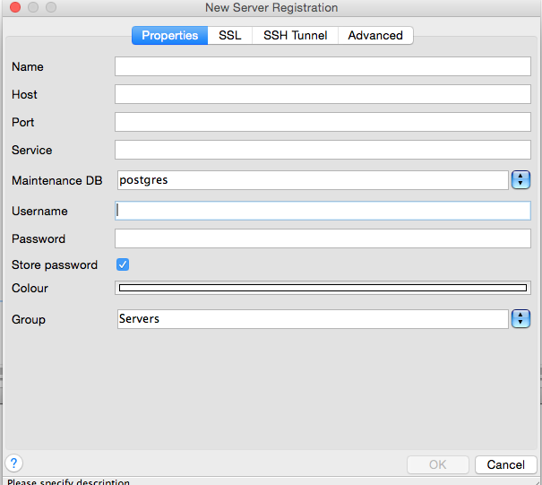

---

copyright:
  years: 2017,2018
lastupdated: "2017-06-07"

keywords: postgresql, compose

subcollection: compose-for-postgresql

---

{:new_window: target="_blank"}
{:shortdesc: .shortdesc}
{:screen: .screen}
{:codeblock: .codeblock}
{:pre: .pre}

# Connecting an external application
{: #external-app}

You can connect an external application to {{site.data.keyword.composeForPostgreSQL_full}} in two ways.

- A **Connection String** can be used by some client libraries, and contains all the information that is needed for other libraries to connect.

- **Command Line** is a preformatted command that invokes `psql` with the correct parameters.

You can find both on the *Overview* page of your {{site.data.keyword.composeForPostgreSQL}} service.

## Connecting with a language's driver

Postgres has a vast array of language drivers. The table covers a few of the most common.

Language|Driver|Examples
----------|-----------
PHP|`pgsql`|[Link](http://php.net/manual/en/pgsql.examples-basic.php)
Ruby|`ruby-pg`|[Link](https://github.com/ged/ruby-pg)
Ruby on Rails|Rails|[Rails Guide](http://edgeguides.rubyonrails.org/configuring.html#configuring-a-postgresql-database)
Python|`Psycopg2`|[Link](https://wiki.postgresql.org/wiki/Psycopg2_Tutorial)
C#|`ODBC`|[Link](https://wiki.postgresql.org/wiki/Using_Microsoft_.NET_with_the_PostgreSQL_Database_Server_via_ODBC)
Go|`pq`|[Link](https://godoc.org/github.com/lib/pq)
Node|`node-postgres`|[Link](https://node-postgres.com/)

## Connecting with the command line

To connect to Postgres from the command line, use `psql`. To use `psql` you need to install the PostgreSQL client tools on the local system. They can be installed with the full PostgreSQL package that is provided from [postgresql.org](https://www.postgresql.org/download/), or as a [package from your operating system's package manager](https://www.compose.com/articles/postgresql-tips-installing-the-postgresql-client/). 

You can read more about `psql` in the PostgreSQL documentation - [reference](https://www.postgresql.org/docs/current/static/app-psql.html) - and a simple [introduction](http://postgresguide.com/utilities/psql.html) in Postgres Guide.

You can find the command line command that you need to use in your {{site.data.keyword.composeForPostgreSQL}} instance dashboard, from the **Overview** tab.

```
psql "sslmode=require host=bluemix-sandbox-dal-9-portal.6.dblayer.com port=24761 dbname=compose user=admin"
```

When you enter the command you are prompted for the password, which you can find in the Connection String information on the same tab or in *Service credentials*.

## Connecting with pgAdmin3

pgAdmin3 is a popular GUI client for PostgreSQL. Use the following steps to connect with pgAdmin3

1. Download and install the version of pgAdmin3 for your operating system from [https://www.pgadmin.org/](https://www.pgadmin.org/).
2. Run pgAdmin3 and select "Add Server" from the menu bar to create a new connection to open the *New Server Registration* panel.

  

3. Complete the fields in the panel with the information in your {{site.data.keyword.composeForPostgreSQL}} service Overview page.

  <dl>
  <dt>Name</dt>
  <dd>A description of your Postgres deployment.  For simplicity, use the same name as used in Compose.</dd>
  <dt>Host</dt>
  <dd>The `host` value from your connection string.</dd>
  <dt>Port</dt>
  <dd>The `port` value from your connection string.</dd>
  <dt>Username</dt>
  <dd>The user name for admin, or for a user that you have created.</dd>
  <dt>Password</dt>
  <dd>The password for either admin (found in the Credentials section), or for a user that you have created.</dd>
  </dl>

4. Select the **SSL** tab.

  

5. Change SSL to 'require'.
6. Click **OK** to save the connection settings and connect to the database.
