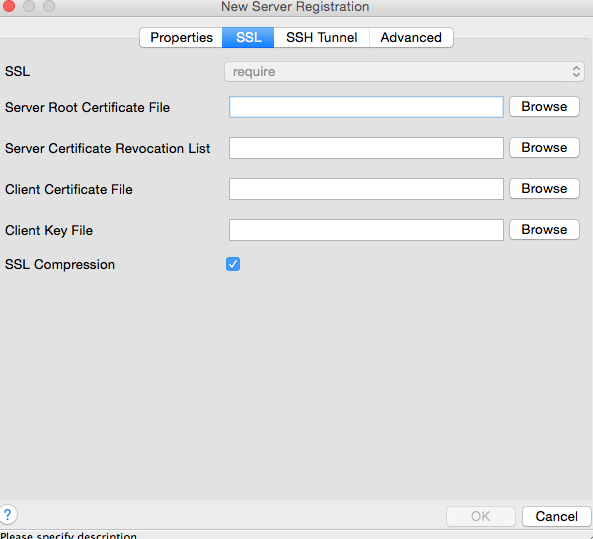

---

copyright:
  years: 2017
lastupdated: "2017-06-07"
---

{:new_window: target="_blank"}
{:shortdesc: .shortdesc}
{:screen: .screen}
{:codeblock: .codeblock}
{:pre: .pre}

# Connecting an external application
{: #connecting-external-app}

There are two ways of connecting an external application to {{site.data.keyword.composeForPostgreSQL_full}}:

- A **Connection String** can be used by some client libraries and contains all the information needed for other libraries to connect.

- **Command Line** is a preformatted command which will invoke `psql` with the correct parameters.

You'll find both on the *Overview* page of your {{site.data.keyword.composeForPostgreSQL}} service.

## Connecting with a language's driver

Postgres has a vast array of language drivers.  The table covers a few of the most common.

Language|Examples
----------|-----------
PHP|[pgsql](http://php.net/manual/en/pgsql.examples-basic.php)
Ruby|[ruby-pg](https://bitbucket.org/ged/ruby-pg/wiki/Home)
Ruby on Rails|[Rails guide](http://edgeguides.rubyonrails.org/configuring.html#configuring-a-postgresql-database)
Python|[Psycopg2](https://wiki.postgresql.org/wiki/Psycopg2_Tutorial)
C#|[ODBC](https://wiki.postgresql.org/wiki/Using_Microsoft_.NET_with_the_PostgreSQL_Database_Server_via_ODBC)
Go|[pq](https://godoc.org/github.com/lib/pq)
Node|[node-postgres](https://github.com/brianc/node-postgres/wiki/Example)

## Connecting with the command line

**psql** is the command line tool to connect to Postgres. To use it, the PostgreSQL client tools will need to be installed on the local system. They can be installed by installing the full PostgreSQL package downloaded from postgresql.org, from your operating systems packages or on MacOS X with brew installed, run `brew install postgresql`).   

You can read more about psql in the PostgreSQL documentation - [reference](https://www.postgresql.org/docs/current/static/app-psql.html) - and a simple [introduction](http://postgresguide.com/utilities/psql.html) in Postgres Guide.

You can find the command line command you need to use in your {{site.data.keyword.composeForPostgreSQL}} instance dashboard, from the Overview tab.

```
psql "sslmode=require host=bluemix-sandbox-dal-9-portal.6.dblayer.com port=24761 dbname=compose user=admin"
```

When you enter the command you will be prompted for the password, which you can find in the Connection String information on the same tab or in the *Service credentials*.

## Connecting with pgAdmin3

pgAdmin3 is a popular GUI client for PostgreSQL. Use the following steps to connect with pgAdmin 3

1. Download and install the version of pgAdmin3 for your operating system from [https://www.pgadmin.org/](https://www.pgadmin.org/).
2. Run pgAdmin3 and select "Add Server" from the menu bar to create a new connection to open the *New Server Registration* panel.

  

3. Complete the fields in the panel with the information in your {{site.data.keyword.composeForPostgreSQL}} service Overview page:

  * **Name**: can be anything describing your Postgres deployment.  For simplicity, make this the same name as used in Compose.
  * **Host**: this will be from the host part of your connection string.
  * **Port**: this will be from the port part of your connection string.
  * **Username**: this will be the username for either admin or a user you have created.
  * **Password**: this will be the password for either admin (found in the Credentials section) or a user you have created.

4. After completing the fields, select the "SSL" tab:

  

5. Change SSL to "require".
6. Click "OK" to save the connection settings and connect to the database.
