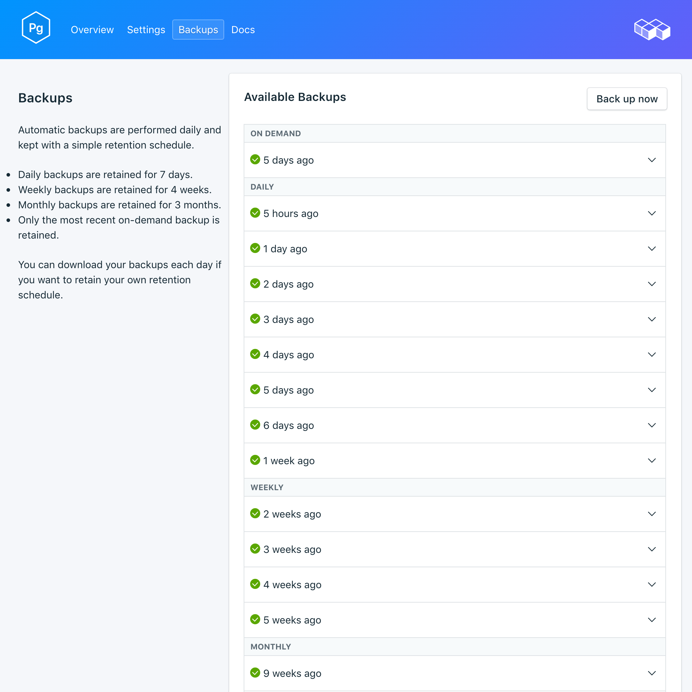

---

copyright:
  years: 2017,2018
lastupdated: "2018-03-02"
---

{:new_window: target="_blank"}
{:shortdesc: .shortdesc}
{:screen: .screen}
{:codeblock: .codeblock}
{:pre: .pre}

# Backups
{: #dashboard-backups}

You can create and download backups from the _Backups_ tab of the _Manage_ page of your service dashboard. Daily, weekly, monthly, and on-demand backups are available. They are retained according to the following schedule:

Backup type|Retention schedule
----------|-----------
Daily|Daily backups are retained for 7 days
Weekly|Weekly backups are retained for 4 weeks
Monthly|Monthly backups are retained for 3 months
On-demand|One on-demand backup is retained. The retained backup is always the most recent on-demand backup.
{: caption="Table 1. Backup retention schedule" caption-side="top"}

Backup schedules and retention policies are fixed. If you need to keep more backups than the retention schedule allows, you should download backups and retain archives according to your business requirements.

## Viewing existing backups

Daily backups of your database are automatically scheduled. To view your existing backups, navigate to the *Manage* page of your service dashboard. 

  

Click the corresponding row to expand the options for any available backup.

   

### Using the API to view existing backups

A list of backups is available at the `GET /2016-07/deployments/:id/backups` endpoint. The Foundation Endpoint with the service instance ID, and the deployment ID are both shown in the service's _Overview_. For example: 
``` 
https://composebroker-dashboard-public.mybluemix.net/api/2016-07/instances/$INSTANCE_ID/deployments/$DEPLOYMENT_ID/backups
```  

## Creating a backup on demand

To create a manual backup, go to the *Manage* page of your service dashboard and click *Backup now*.

### Using the API to create a backup

Send a POST request to the backups endpoint to initiate a manual back up: `POST /2016-07/deployments/:id/backups`. It returns immediately with the recipe ID and information about the backup as it is running. You will have to check the backups endpoint to see whether the backup finished and find its backup_id before using it. Use `GET /2016-07/deployments/:id/backups/`.

## Downloading a backup

To download a backup, go to the *Manage* page of your service dashboard and click *Download* in the corresponding row for the backup you want to download.

### Using the API to download a backup

Find the backup that you want to restore from on the _Backups_ page on your service and copy the backup_id, or use the `GET /2016-07/deployments/:id/backups` to find a backup and its backup_id through the Compose API. Then, use the backup_id to find information and a download link for a specific backup: `GET /2016-07/deployments/:id/backups/:backup_id`.

## Backup contents

{{site.data.keyword.composeForPostgreSQL}} backups use `pg_basebackup` on your running service instance. The backup makes a binary copy of the cluster files and includes all files in the data directory and all tablespaces. The backup also includes the WAL (write ahead log) file, which you can use to restore a database to a time point covered by the WAL data.

## Using a backup with a local database

You can use your {{site.data.keyword.composeForPostgreSQL}} backup to run a local copy of your database. The file structure of the backup allows for multiple backups to be stored in the same directory; the top few levels are `data --> backup --> *datestamp*`. Inside the datestamped directory, you'll find the snapshot and the WAL archive.

To restore to a local database:

1. Download a backup
2. Open the readme file that is included in the backup - `data/backup/*timestamp*/snapshot/README` - in a text editor.
3. Download and install PostgreSQL locally. The readme file indicates the version of PostgreSQL that the backup should be run with.
4. Follow the instructions in the readme file to run a local copy of your database. Start your local PostgreSQL inside the snapshot directory with the command `postgres -D conf`. You can then connect to the database by running: `psql postgres -U focker`.

## Restoring a backup

To restore a backup to a new service instance, follow the steps to view existing backups, then click in the corresponding row to expand the options for the backup you want to download. Click **Restore**. A message is displayed to let you know that a restore is in progress. The new service instance is automatically named "postgres-restore-[timestamp]", and appears on your dashboard when provisioning starts.

### Restoring via the {{site.data.keyword.cloud_notm}} CLI

Use the following steps to restore a backup from a running PostgreSQL service to a new PostgreSQL service using the {{site.data.keyword.cloud_notm}} CLI. 

1. If you need to, [download and install it](https://{DomainName}/docs/cli/index.html#overview). 
2. Find the backup you want to restore from on the _Backups_ page on your service and copy the backup ID.  
  **Or**  
  Use the `GET /2016-07/deployments/:id/backups` to find a backup and its ID through the Compose API. The Foundation Endpoint and the service instance ID are both shown in the service's _Overview_.

  ``` 
  https://composebroker-dashboard-public.mybluemix.net/api/2016-07/instances/$INSTANCE_ID/deployments/$DEPLOYMENT_ID/backups
  ```

  The response contains a list of all available backups for that service instance. Pick the backup you want to restore from and copy its ID.

3. Log in with the appropriate account and credentials. Use `ibmcloud login`. 

  Use `ibmcloud login -help` to see all the login options.
  {: tip}

4. Switch to your Organization and Space.

  ```
  ibmcloud target -o "$YOUR_ORG" -s "YOUR_SPACE"
  ```

5. Use the `service create` command to provision a new service, and provide the source service and the specific backup that you are restoring in a JSON object.

  ``` 
  ibmcloud service create SERVICE PLAN SERVICE_INSTANCE_NAME -c '{"source_service_instance_id": "$SERVICE_INSTANCE_ID", "backup_id": "$BACKUP_ID" }'
  ```

  <dl>
  <dt>_SERVICE_</dt>
  <dd>Use `compose-for-postgresql`.</dd>
  <dt>_PLAN_</dt>
  <dd>Use either Standard or Enterprise depending on your environment.</dd>
  <dt>_SERVICE\_INSTANCE\_NAME_</dt>
  <dd>The name of your new service.</dd>
  <dt>_source\_service\_instance\_id_</dt>
  <dd>The service instance ID of the source of the backup. You can obtain the value by running `ibmcloud cf service DISPLAY_NAME --guid`, where _DISPLAY\_NAME_ is the name of the service the backup is from. </dd>
  </dl>
  
  Enterprise users also need to specify which cluster to deploy to in the JSON object with the `"cluster_id": "$CLUSTER_ID"` parameter.
    
### Migrating to a New Version

Some major version upgrades are not available in the current running deployment. To migrate to these versions, you need to provision a new service that is running the upgraded version, and then migrate your data into it using a backup. This process is the same a restoring a backup, except you specify the version you want to upgrade to.

``` 
ibmcloud service create SERVICE PLAN SERVICE_INSTANCE_NAME -c '{"source_service_instance_id": "$SERVICE_INSTANCE_ID", "backup_id": ""$BACKUP_ID", "db_version":"$VERSION_NUMBER" }'
```

For example,  to restore an older version of a {{site.data.keyword.composeForPostgreSQL}} service to a new service running PostgreSQL 9.6.6, use the following command.

```
ibmcloud service create compose-for-postgresql Standard migrated_postgres -c '{ "source_service_instance_id": "0269e284-dcac-4618-89a7-f79e3f1cea6a", "backup_id":"5a96d8a7e16c090018884566", "db_version":"9.6.6"  }'
