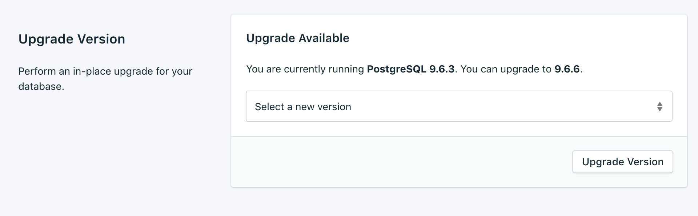
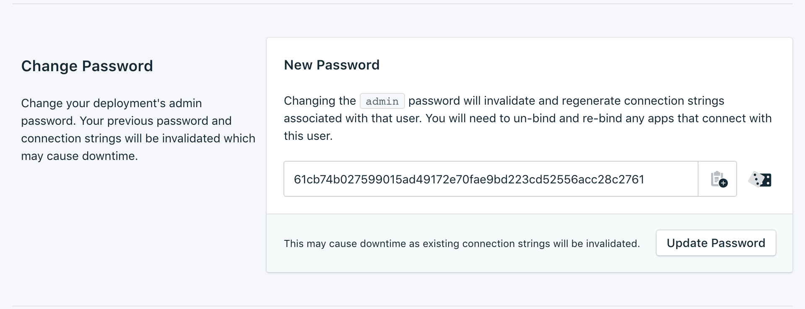

---

Copyright:
  years: 2017,2018
lastupdated: "2017-10-23"

keywords: postgresql, compose

subcollection: ComposeForPostgreSQL

---

{:new_window: target="_blank"}
{:shortdesc: .shortdesc}
{:screen: .screen}
{:codeblock: .codeblock}
{:pre: .pre}
{:tip: .tip}

# Settings
{: #dashboard-settings}

Use these features to adapt your {{site.data.keyword.composeForPostgreSQL_full}} service to better suit your needs and requirements.

## Upgrade Version

If there is a new version of the database available, you can select the version that you want to upgrade to from the drop-down menu. Otherwise, your service is on the newest version available, and the panel displays the current version information.

## Scaling Resources

You can increase or reduce the amount of storage that is allocated to your service by scaling resources.

1. Go to your service's _Settings_ page.
2. In the _Deployment Details_ panel, click **Scale Resources**. The Scale Resouces page opens.

    

3. Adjust the slider to increase or reduce the storage that is allocated to the {{site.data.keyword.composeForPostgreSQL}} service. Move the slider to the left to reduce the amount of storage, or move it to the right to increase the storage.
4. Click **Scale Deployment** to trigger the rescaling and return to the dashboard overview. 

When the scaling is complete the _Deployment Details_ pane updates to show the current usage and the new value for the available storage.

## Updating the Service Password

You might find it necessary to change the password of your service. You can do so by using _Update Password_. 

1. Go to your service's _Settings_ page.
2. Go to the _Change Password_ section.

  A new, randomly generated password is displayed. You can use this password, or you can type your own password into the field. To regenerate another password, click **Generate**. 
  

3. To update your password to the new value, click **Update Password**. You will be asked to confirm the change.
4. Click **Update Password** in the dialog to confirm the new password, or click **cancel** to cancel the change.

  The _Deployment Details_ pane shows the progress of the running job.

Changing the password changes the credentials that you and your services use to connect, and invalidates your service's connection string. It can also result in downtime.
{: tip}

### Updating Connected Applications

Changing the password invalidates the existing connection string and generate a new one. This will cause a service interruption until any connected applications are updated with the new connection string.

For more information about connecting your applications, see [Connecting an {{site.data.keyword.cloud}} Application](/docs/ComposeForPostgreSQLtopic?=compose-for-postgresql-ibmcloud-cf-app) and [Connecting an external application](/docs/ComposeForPostgreSQLtopic?=compose-for-postgresql-external-app).

## Whitelists

If you want to restrict access to your databases, you can whitelist specific IP addresses or ranges of IP addresses on your service. When there are no IP addresses in the whitelist, the whitelist is disabled and the deployment will accept connections from any system on the internet.

### IP Addresses
The *IP* field can take a single complete IPv4 address or IPv6 address with or without a netmask. Without a netmask, incoming connections must come from exactly that IP address. 

Although the *IP* field allows for IPv6, no Compose deployments are currently available to IPv6 networking and so these addresses cannot be filtered on.
{: tip}

### Netmasks

To allow a connection from a specified range of IP addresses, use a netmask. The IP address must be fully specified when using a netmask. That means entering, for example, 192.168.1.0/24 rather than 192.168.1/24.

### Description

The *Description* can be any user-significant text for identifying the whitelist entry - a customer name, project identifier, or employee number, for example. The description field is required.

### Compose Services
Whitelist entries are automatically added to Compose's servers to allow them to connect.

### Removal
To remove an IP address or netmask from the Whitelist, click *Remove*.
When all entries on the whitelist are removed, the whitelist will be disabled and all IP addresses are accepted by the TCP access portals.
