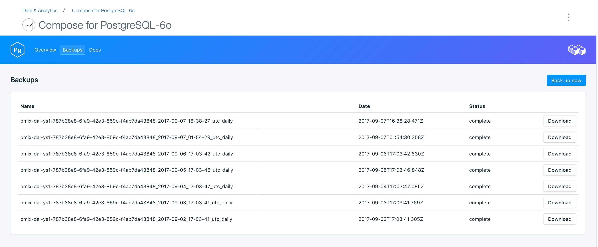

---

copyright:
  years: 2017
lastupdated: "2017-07-13"
---

{:new_window: target="_blank"}
{:shortdesc: .shortdesc}
{:screen: .screen}
{:codeblock: .codeblock}
{:pre: .pre}

# Backups
{: #backups}

You can create and download backups from the *Manage* page of your service dashboard. Both scheduled and manual backups are available.

## Viewing existing backups

Daily backups of your database are automatically scheduled. To view your existing backups, navigate to the *Manage* page of your service dashboard. 

## Creating a backup on demand

As well as scheduled backups you can create a backup manually. To create a manual backup, navigate to the *Manage* page of your service dashboard and click *Backup now*.

## Downloading a backup

To download a backup, navigate to the *Manage* page of your service dashboard and click *Download* in the corresponding row for the backup you wish to download.

## Backup contents

{{site.data.keyword.composeForPostgreSQL}} backups use `pg_basebackup` on your running service instance. The backup makes a binary copy of the cluster files and includes all files in the data directory and all tablespaces. The backup also includes the WAL (write ahead log) file, which you can use to restore a database to a time point covered by the WAL data.

## Using a backup with a local database

You can use your {{site.data.keyword.composeForPostgreSQL}} backup to run a local copy of your database. The file structure of the backup allows for multiple backups to be stored in the same directory; the top few levels are `data --> backup --> *datestamp*`. Inside the datestamped directory you'll find the snapshot and the WAL archive.

To restore to a local database:

1. Download a backup
2. The backup includes a README file: `data/backup/*timestamp*/snapshot/README`. Open the README file in a text editor.
3. Download and install PostgreSQL locally. The README file indicates the version of PostgreSQL that the backup should be run with.
4. Follow the instructions in the README file to run a local copy of your database. Start your local PostgreSQL inside the snapshot directory with the command `postgres -D conf`. You can then connect to the db by running: `psql postgres -U focker`.
