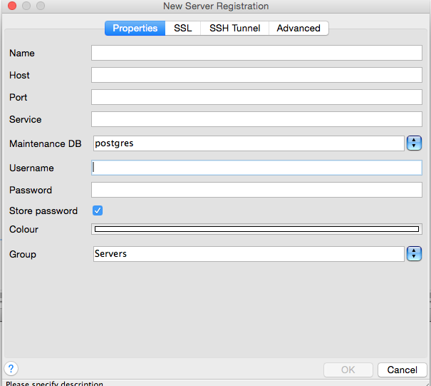

---

copyright:
  years: 2017
lastupdated: "2017-06-07"
---

{:new_window: target="_blank"}
{:shortdesc: .shortdesc}
{:screen: .screen}
{:codeblock: .codeblock}
{:pre: .pre}

# Externe Anwendung verbinden
{: #connecting-external-app}

Es gibt zwei Möglichkeiten, eine externe Anwendung mit {{site.data.keyword.composeForPostgreSQL_full}} zu verbinden:

- Eine **Verbindungszeichenfolge** kann von bestimmten Clientbibliotheken verwendet werden und enthält alle Informationen, die andere Bibliotheken zum Herstellen einer Verbindung benötigen.

- Die **Befehlszeile** ist ein vorformatierter Befehl, der `psql` mit den korrekten Parametern aufruft. 

Beides finden Sie auf der Seite *Übersicht* Ihres {{site.data.keyword.composeForPostgreSQL}}-Service.

## Verbindung mit Sprachentreiber herstellen

Postgres besitzt eine Vielzahl von Sprachentreibern. In der Tabelle werden einige der bekanntesten aufgeführt.

Sprache|Beispiele
----------|-----------
PHP|[pgsql](http://php.net/manual/en/pgsql.examples-basic.php)
Ruby|[ruby-pg](https://bitbucket.org/ged/ruby-pg/wiki/Home)
Ruby on Rails|[Rails guide](http://edgeguides.rubyonrails.org/configuring.html#configuring-a-postgresql-database)
Python|[Psycopg2](https://wiki.postgresql.org/wiki/Psycopg2_Tutorial)
C#|[ODBC](https://wiki.postgresql.org/wiki/Using_Microsoft_.NET_with_the_PostgreSQL_Database_Server_via_ODBC)
Go|[pq](https://godoc.org/github.com/lib/pq)
Node|[node-postgres](https://github.com/brianc/node-postgres/wiki/Example)

## Verbindung über die Befehlszeile herstellen

**psql** ist das Befehlszeilentool, mit dem eine Verbindung zu Postgres hergestellt wird. Um es verwenden zu können, müssen die PostgreSQL-Client-Tools auf dem lokalen System installiert sein. Dazu müssen Sie das ganze PostgreSQL-Paket zunächst von postgresql.org herunterladen. Zum Installieren müssen Sie dann über Ihre Betriebssystempakete oder unter MacOS X mit installiertem brew den Befehl `brew install postgresql` ausführen.   

Weitere Informationen zu psql finden Sie in der Dokumentation zu PostgreSQL - [Referenz](https://www.postgresql.org/docs/current/static/app-psql.html) - und in einer einfachen [Einführung](http://postgresguide.com/utilities/psql.html) im Postgres-Handbuch.

Den Befehlszeilenbefehl, den Sie verwenden müssen, finden Sie im Dashboard Ihrer {{site.data.keyword.composeForPostgreSQL}}-Instanz auf der Registerkarte 'Übersicht'.

```
psql "sslmode=require host=bluemix-sandbox-dal-9-portal.6.dblayer.com port=24761 dbname=compose user=admin"
```

Wenn Sie den Befehl eingeben, werden Sie zur Eingabe eines Kennworts aufgefordert. Dieses finden Sie auf derselben Registerkarte in den Verbindungszeichenfolgeinformationen oder in den *Serviceberechtigungsnachweisen*.

## Verbindung mit pgAdmin3 herstellen

pgAdmin3 ist ein beliebter GUI-Client für PostgreSQL. Führen Sie die folgenden Schritte aus, um eine Verbindung mit pgAdmin3 herzustellen:

1. Laden Sie die für Ihr Betriebssystem passende Version von pgAdmin3 von [https://www.pgadmin.org/](https://www.pgadmin.org/) herunter und installieren Sie sie.
2. Führen Sie pgAdmin3 aus und wählen Sie in der Menüleiste "Server hinzufügen" aus, um eine neue Verbindung zu öffnen und die Anzeige *Neue Serverregistrierung* zu öffnen.

  

3. Geben Sie in den Feldern der Anzeige die Angaben aus der Übersichtsseite Ihres {{site.data.keyword.composeForPostgreSQL}}-Service ein:

  * **Name**: Ein beliebiger Text zur Beschreibung Ihrer Postgres-Bereitstellung. Zur Vereinfachung sollte dieser Name mit dem in Compose verwendeten identisch sein.
  * **Host**: Der Hostabschnitt in Ihrer Verbindungszeichenfolge.
  * **Port**: Der Portabschnitt in Ihrer Verbindungszeichenfolge.
  * **Benutzername**: Der Benutzername des Administrators oder eines Benutzers, den Sie erstellt haben.
  * **Kennwort**: Das Kennwort des Administrators (befindet sich im Bereich mit den Berechtigungsnachweisen) oder eines Benutzers, den Sie erstellt haben.

4. Wählen Sie nach dem Ausfüllen der Felder die Registerkarte "SSL" aus:

  

5. Ändern Sie SSL in "require" (erfordern).
6. Klicken Sie auf "OK", um die Verbindungseinstellungen zu speichern und eine Verbindung zu der Datenbank herzustellen.
