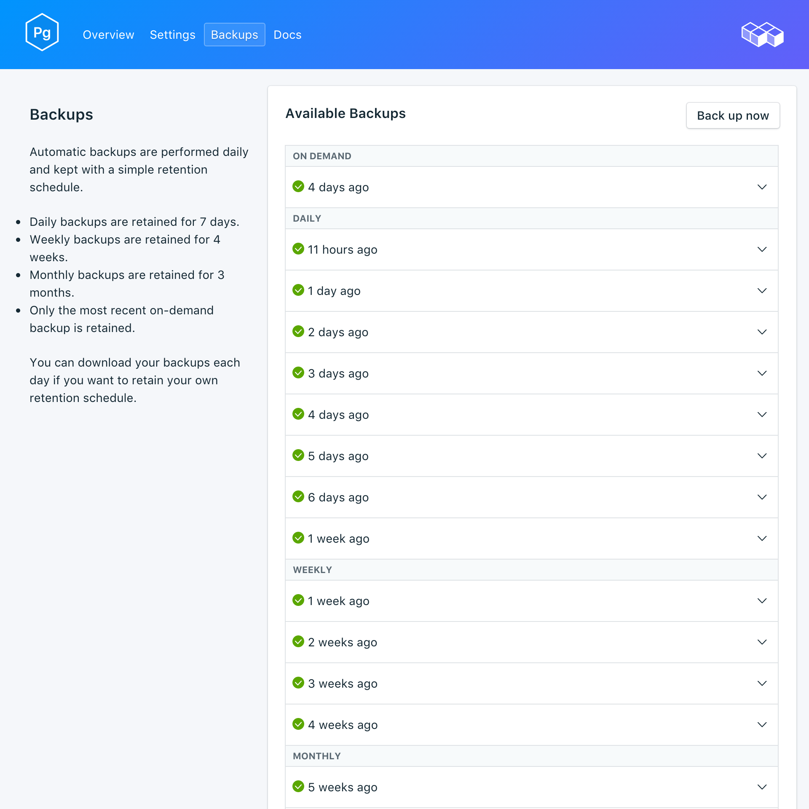

---

copyright:
  years: 2017
lastupdated: "2017-09-07"
---

{:new_window: target="_blank"}
{:shortdesc: .shortdesc}
{:screen: .screen}
{:codeblock: .codeblock}
{:pre: .pre}

# Sicherungen
{: #backups}

Sie können Sicherungen erstellen und über die Seite *Verwalten* Ihres Service-Dashboards herunterladen. Es sind sowohl geplante als auch manuelle Sicherungen verfügbar.

## Vorhandene Sicherungen anzeigen

Tägliche Sicherungen Ihrer Datenbank werden automatisch geplant. Navigieren Sie zum Anzeigen Ihrer vorhandenen Sicherungen zu der Seite *Verwalten* Ihres Service-Dashboards. 

Klicken Sie in eine Zeile, um die Optionen für die entsprechende verfügbare Sicherung zu erweitern.

 

## Sicherung bedarfsgerecht erstellen

Neben geplanten Sicherungen können Sie manuelle Sicherungen erstellen. Navigieren Sie zum Erstellen einer manuellen Sicherung zu der Seite *Verwalten* Ihres Service-Dashboards und klicken Sie auf *Jetzt sichern*.

## Sicherung herunterladen

Navigieren Sie zum Herunterladen einer Sicherung zu der Seite *Verwalten* Ihres Service-Dashboards und klicken Sie in der entsprechenden Zeile mit der Sicherung, die Sie herunterladen wollen, auf *Herunterladen*.

## Inhalt von Sicherungen

{{site.data.keyword.composeForPostgreSQL}}-Sicherungen verwenden `pg_basebackup` in Ihrer gerade aktiven Serviceinstanz. Die Sicherung erstellt eine binäre Kopie der Clusterdateien und schließt alle Dateien im Datenverzeichnis sowie alle Tabellenbereiche ein. Außerdem gehört zu der Sicherung die WAL-Datei (Write-ahead-Protokoll), mit der Sie eine Datenbank auf einen Zeitpunkt wiederherstellen können, der von den WAL-Daten abgedeckt wird.

## Sicherung mit lokaler Datenbank verwenden

Sie können mit Ihrer {{site.data.keyword.composeForPostgreSQL}}-Sicherung eine lokale Kopie Ihrer Datenbank ausführen. Dank der Dateistruktur der Sicherung können mehrere Sicherungen in demselben Verzeichnis gespeichert werden. Die obersten Ebenen sind `data --> backup --> *datestamp*`. Im Verzeichnis mit der Datumszeitmarke (datestamp) befinden sich der Snapshot und das WAL-Archiv.

Gehen Sie wie folgt vor, um eine lokale Datenbank wiederherzustellen:

1. Laden Sie eine Sicherung herunter.
2. Die Sicherung enthält eine README-Datei: `data/backup/*timestamp*/snapshot/README`. Öffnen Sie die README-Datei in einem Texteditor.
3. Laden Sie PostgreSQL herunter und installieren Sie die Software lokal. Die README-Datei gibt die PostgreSQL-Version an, mit der die Sicherung ausgeführt werden sollte.
4. Folgen Sie den Anweisungen in der README-Datei, um eine lokale Kopie Ihrer Datenbank auszuführen. Starten Sie Ihre lokale Instanz von PostgreSQL im Verzeichnis 'snapshot' mit dem Befehl `postgres -D conf`. Anschließend können Sie mit dem Befehl `psql postgres -U focker` eine Verbindung zu der Datenbank herstellen.

## Sicherung wiederherstellen

Führen Sie zum Wiederherstellen einer Sicherung in eine neue Serviceinstanz die Schritte zum Anzeigen der vorhandenen Sicherungen aus. Klicken Sie dann in die entsprechende Zeile, um die Optionen für die Sicherung zu erweitern, die Sie herunterladen wollen. Klicken Sie auf die Schaltfläche **Wiederherstellen**. Es wird eine Nachricht darüber angezeigt, dass eine Wiederherstellung eingeleitet wurde. Die neue Serviceinstanz erhält automatisch den Namen "postgres-restore-[timestamp]" und wird beim Start der Bereitstellung in Ihrem Dashboard angezeigt.
