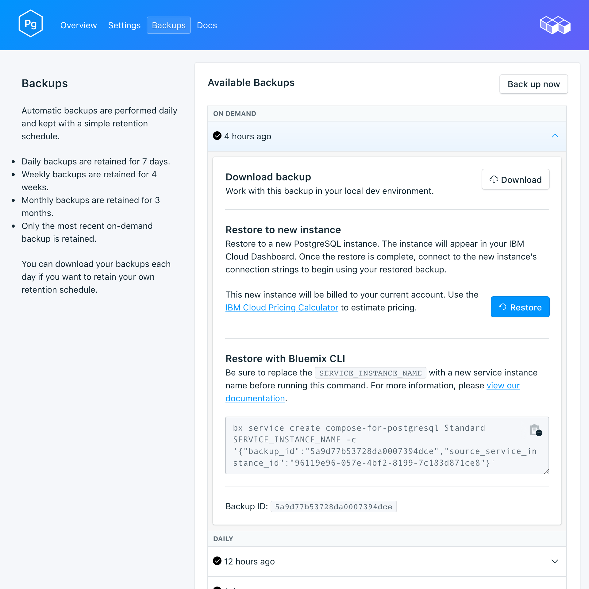

---

copyright:
  years: 2017
lastupdated: "2017-09-07"
---

{:new_window: target="_blank"}
{:shortdesc: .shortdesc}
{:screen: .screen}
{:codeblock: .codeblock}
{:pre: .pre}

# Copias de seguridad
{: #backups}

Puede crear y descargar copias de seguridad desde la página *Gestionar* del panel de control del servicio. Dispone de copias de seguridad planificadas y manuales.

## Visualización de las copias de seguridad existentes

Se planifican automáticamente copias de seguridad diarias de la base de datos. Para ver las copias de seguridad existentes, vaya a la página *Gestionar* del panel de control del servicio. 

Pulse en la fila correspondiente para ampliar las opciones para cualquier copia de seguridad disponible.

 

## Creación de una copia de seguridad a petición

Además de copias de seguridad planificadas, puede crear una copia de seguridad manualmente. Para crear una copia de seguridad manual, vaya a la página *Gestionar* del panel de control del servicio y pulse *Copia de seguridad ahora*.

## Descarga de una copia de seguridad

Para descargar una copia de seguridad, vaya a la página *Gestionar* del panel de control del servicio y pulse *Descargar* en la fila correspondiente a la copia de seguridad que desea descargar.

## Contenido de una copia de seguridad

Las copias de seguridad de {{site.data.keyword.composeForPostgreSQL}} utilizan `pg_basebackup` en la instancia del servicio en ejecución. La seguridad hace una copia binaria de los archivos del clúster e incluye todos los archivos en el directorio de datos y todos los espacios de tabla. La copia de seguridad también incluye el WAL (archivo de escritura anticipada), que puede utilizar para restaurar una base de datos a un punto en el tiempo cubierto por los datos de WAL.

## Utilización de una copia de seguridad con una base de datos local

Puede utilizar la copia de seguridad de {{site.data.keyword.composeForPostgreSQL}} para ejecutar una copia local de la base de datos. La estructura de archivos de la copia de seguridad permite almacenar varias copias de seguridad en el mismo directorio; los niveles superiores son `data --> backup --> *datestamp*`. Dentro del directorio con la indicación de fecha y hora encontrará la instantánea del archivo WAL.

Para restaurar a una base de datos local:

1. Descargue una copia de seguridad
2. La copia de seguridad incluye un archivo README: `data/backup/*timestamp*/snapshot/README`. Abra el archivo README en un editor de texto.
3. Descargue e instale PostgreSQL localmente. El archivo README indica la versión de PostgreSQL con la que se debe ejecutar la copia de seguridad.
4. Siga las instrucciones del archivo README para ejecutar una copia local de la base de datos. Inicie su PostgreSQL local dentro del directorio de instantáneas con el mandato `postgres -D conf`. Luego puede conectar con la bd ejecutando: `psql postgres -U focker`.

## Restauración de una copia de seguridad

Para restaurar una copia de seguridad en una nueva instancia de servicio, siga los pasos para ver las copias de seguridad existentes y luego pulse en la fila correspondiente para ampliar las opciones para la copia de seguridad que desea descargar. Pulse el botón **Restaurar**. Se mostrará un mensaje que le indicará que se ha iniciado una restauración. A la nueva instancia del servicio se le asignará automáticamente el nombre "postgres-restore-[timestamp]" y aparecerá en el panel de control cuando comience el suministro.
