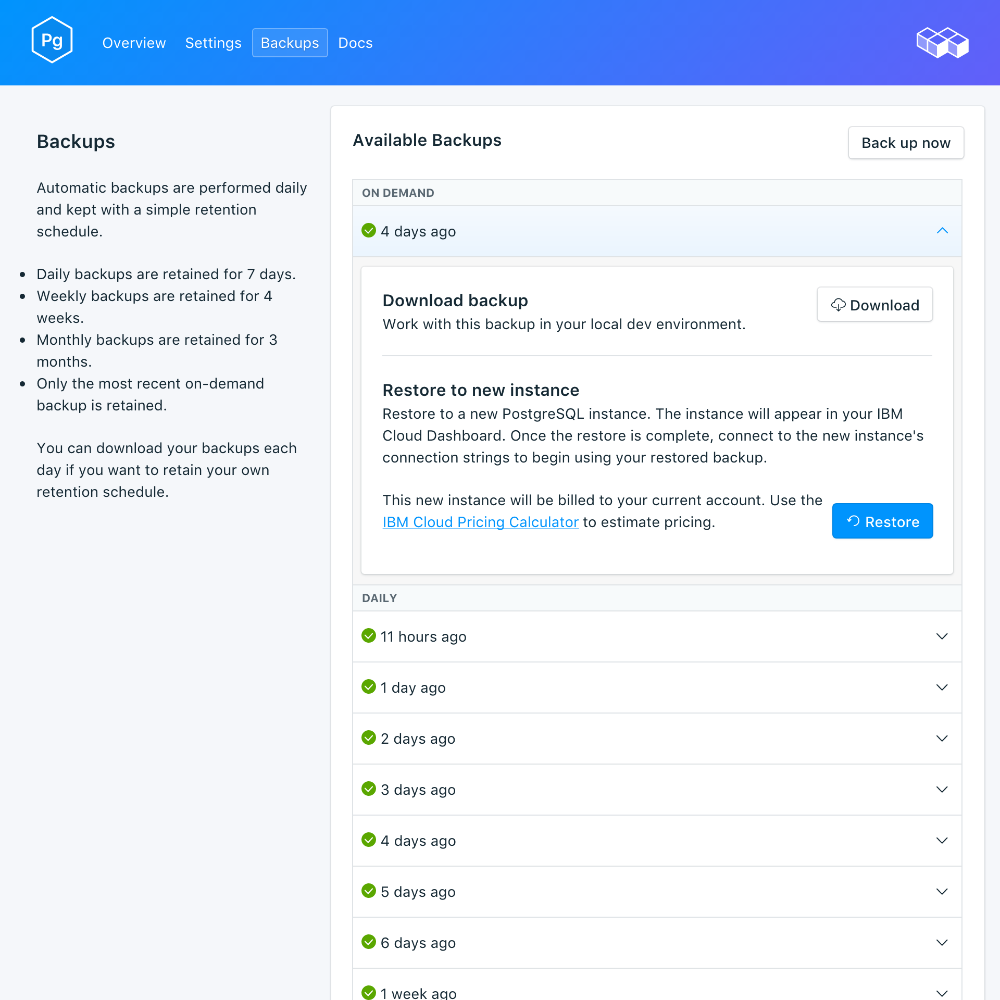

---

copyright:
  years: 2017,2018
lastupdated: "2018-03-02"
---

{:new_window: target="_blank"}
{:shortdesc: .shortdesc}
{:screen: .screen}
{:codeblock: .codeblock}
{:pre: .pre}

# Sauvegardes
{: #backups}

Vous pouvez créer et télécharger des sauvegardes à partir de l'onglet _Backups_ de la page de gestion du tableau de bord de votre service. Vous avez le choix entre les sauvegardes quotidiennes, hebdomadaires, mensuelles et à la demande. Elles sont conservées selon la planification suivante :

Type de sauvegarde|Planification de conservation
----------|-----------
Quotidienne|Les sauvegardes quotidiennes sont conservées pendant 7 jours
Hebdomadaire|Les sauvegardes hebdomadaires sont conservées pendant 4 semaines
Mensuelle|Les sauvegardes mensuelles sont conservées pendant 3 mois
A la demande|Une seule sauvegarde à la demande est conservée. Il s'agit toujours de la dernière sauvegarde à la demande effectuée.
{: caption="Tableau 1. Planification de conservation des sauvegardes" caption-side="top"}

Les planifications de sauvegarde et les règles de conservation sont fixées. Si vous avez besoin de conserver davantage de sauvegardes que ne le permet la planification de conservation, vous devez télécharger les sauvegardes et les archiver en fonction de vos exigences métier.

## Affichage des sauvegardes existantes

Des sauvegardes quotidiennes de votre base de données sont automatiquement planifiées. Pour afficher vos sauvegardes existantes, accédez à la page de gestion du tableau de bord de votre service. 

  

Cliquez sur la ligne correspondante pour développer les options de chaque sauvegarde disponible.

   

### Utilisation de l'API pour afficher les sauvegardes existantes

Une liste des sauvegardes est disponible sur le noeud final `GET /2016-07/deployments/:id/backups`. L'ID d'instance de service et l'ID de déploiement du noeud final Foundation apparaissent tous les deux dans la page de vue d'ensemble du service. Par exemple : 
``` 
https://composebroker-dashboard-public.mybluemix.net/api/2016-07/instances/$INSTANCE_ID/deployments/$DEPLOYMENT_ID/backups
```  

## Création d'une sauvegarde à la demande

Outre les sauvegardes planifiées, vous pouvez créer une sauvegarde manuelle. Pour créer une sauvegarde manuelle, accédez à la page de gestion du tableau de bord de votre service et cliquez sur *Backup now*.

### Utilisation de l'API pour la création d'une sauvegarde

Envoyez une demande POST au noeud final des sauvegardes pour initier une sauvegarde manuelle : `POST /2016-07/deployments/:id/backups`. Il renvoie immédiatement l'ID de la recette et des informations sur la sauvegarde lors de son exécution. Il vous appartient de vérifier dans le noeud final des sauvegardes si la sauvegarde est terminée et de rechercher son backup_id avant de l'utiliser. Utilisez `GET /2016-07/deployments/:id/backups/`.

## Téléchargement d'une sauvegarde

Pour télécharger une sauvegarde, accédez à la page de gestion du tableau de bord de votre service et cliquez sur *Download* sur la ligne correspondant à la sauvegarde que vous voulez télécharger.

### Utilisation de l'API pour le téléchargement d'une sauvegarde

Recherchez la sauvegarde à restaurer dans la page _Backups_ de votre service et copiez le backup_id ou utilisez `GET /2016-07/deployments/:id/backups` pour rechercher une sauvegarde et son backup_id via l'API Compose. Utilisez ensuite l'élément backup_id pour trouver des informations et le lien de téléchargement concernant une sauvegarde spécifique : `GET /2016-07/deployments/:id/backups/:backup_id`.

## Contenu de sauvegarde

Les sauvegardes {{site.data.keyword.composeForPostgreSQL}} utilisent `pg_basebackup` sur votre instance de service en cours d'exécution. La sauvegarde effectue une copie binaire des fichiers de cluster et inclut tous les fichiers dans le répertoire de données et dans tous les espaces de table. La sauvegarde inclut également le fichier WAL (write ahead log), que vous pouvez utiliser pour restaurer une base de données à un point temporel couvert par les données WAL.

## Utilisation d'une sauvegarde avec une base de données locale

Vous pouvez utiliser votre sauvegarde {{site.data.keyword.composeForPostgreSQL}} pour exécuter une copie locale de votre base de données. La structure de fichier de la sauvegarde permet de stocker plusieurs sauvegardes dans le même répertoire ; les premiers niveaux supérieurs sont `data --> backup --> *datestamp*`. Le répertoire datestamped contient un Instantané de l'archive WAL.

Pour restaurer dans une base de données locale :

1. Téléchargez une sauvegarde.
2. La sauvegarde inclut un fichier README : `data/backup/*timestamp*/snapshot/README`. Ouvrez le fichier README dans un éditeur de texte.
3. Téléchargez et installez PostgreSQL en local. Le fichier README indique la version de PostgreSQL avec laquelle la sauvegarde doit s'exécuter.
4. Suivez les instructions du fichier README pour effectuer une copie locale de votre base de données. Démarrez votre version PostgreSQL locale dans le répertoire des instantanés avec la commande `postgres -D conf`. Vous pouvez ensuite vous connecter à la base de données en exécutant : `psql postgres -U focker`.

## Restauration d'une sauvegarde

Pour restaurer une sauvegarde sur une nouvelle instance de service, suivez la procédure d'affichage des sauvegardes, puis cliquez sur la ligne correspondante afin de développer les options de la sauvegarde que vous voulez télécharger. Cliquez sur le bouton **Restore**. Un message vous indiquant qu'une restauration a été initiée s'affiche. La nouvelle instance de service sera automatiquement nommée "postgres-restore-[timestamp]" ; elle s'affiche dans votre tableau de bord au démarrage de la mise à disposition.

### Restauration via l'interface de ligne de commande {{site.data.keyword.cloud_notm}}

Procédez comme suit pour restaurer une sauvegarde d'un service PostgreSQL en cours d'exécution vers un nouveau service PostgreSQL à l'aide de l'interface de ligne de commande {{site.data.keyword.cloud_notm}}. 
1. Le cas échéant, [téléchargez et installez-la](https://console.bluemix.net/docs/cli/index.html#overview). 
2. Recherchez la sauvegarde à restaurer dans la page _Backups_ de votre service et copiez son ID.  
  **Ou**  
  Utilisez `GET /2016-07/deployments/:id/backups` pour rechercher une sauvegarde et son ID grâce à l'API Compose. Le noeud final Foundation et l'ID d'instance de service s'affichent tous les deux dans la page de vue d'ensemble du service. Par exemple : 
  ``` 
  https://composebroker-dashboard-public.mybluemix.net/api/2016-07/instances/$INSTANCE_ID/deployments/$DEPLOYMENT_ID/backups
  ```  
  La réponse inclut la liste de toutes les sauvegardes disponibles pour cette instance de service. Choisissez la sauvegarde à partir de laquelle procéder à la restauration et copiez son ID.

3. Connectez-vous avec le compte et les données d'identification appropriés : `ibmcloud login` (ou `ibmcloud login -help` pour afficher toutes les options de connexion).

4. Accédez à votre organisation et votre espace : `ibmcloud target -o "$YOUR_ORG" -s "YOUR_SPACE"`

5. Utilisez la commande `service create` pour mettre à disposition un nouveau service et indiquez le source source et la sauvegarde spécifique que vous restaurez dans un objet JSON. Par exemple :
``` 
ibmcloud service create SERVICE PLAN SERVICE_INSTANCE_NAME -c '{"source_service_instance_id": "$SERVICE_INSTANCE_ID", "backup_id": "$BACKUP_ID" }'
```
  _SERVICE_ doit avoir pour valeur compose-for-postgresql et _PLAN_ doit avoir pour valeur Standard ou Enterprise, en fonction de votre environnement. Pour _SERVICE\_INSTANCE\_NAME_, indiquez le nom de votre nouveau service. _source\_service\_instance\_id_ correspond à l'ID d'instance de service de la source de la sauvegarde ; pour l'obtenir, exécutez `ibmcloud cf service DISPLAY_NAME --guid` où _DISPLAY\_NAME_ est le nom du service PostgreSQL à l'origine de la sauvegarde. 
  
  Les utilisateurs Enterprise doivent également indiquer le cluster dans lequel effectuer le déploiement dans l'objet JSON grâce au paramètre `"cluster_id": "$CLUSTER_ID"`.
  
### Migration vers une nouvelle version

Certaines mises à niveau de version principale ne sont pas disponibles dans le déploiement en cours d'exécution. Vous devez alors mettre à disposition un nouveau service qui exécute la version mise à niveau, puis migrer vos données à l'aide d'une sauvegarde. Ce processus est identique à la restauration d'une sauvegarde décrite précédemment, mais vous devez indiquer la version vers laquelle vous souhaitez effectuer la mise à niveau.

``` 
ibmcloud service create SERVICE PLAN SERVICE_INSTANCE_NAME -c '{"source_service_instance_id": "$SERVICE_INSTANCE_ID", "backup_id": ""$BACKUP_ID", "db_version":"$VERSION_NUMBER" }'
```

Par exemple, la restauration d'une version plus ancienne d'un service {{site.data.keyword.composeForPostgreSQL}} vers un nouveau service exécutant PostgreSQL 9.6.6 est similaire à l'exemple suivant :
```
ibmcloud service create compose-for-postgresql Standard migrated_postgres -c '{ "source_service_instance_id": "0269e284-dcac-4618-89a7-f79e3f1cea6a", "backup_id":"5a96d8a7e16c090018884566", "db_version":"9.6.6"  }'
