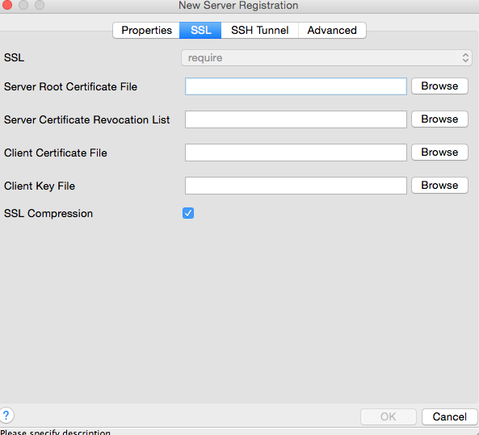

---

copyright:
  years: 2017
lastupdated: "2017-06-07"
---

{:new_window: target="_blank"}
{:shortdesc: .shortdesc}
{:screen: .screen}
{:codeblock: .codeblock}
{:pre: .pre}

# 외부 애플리케이션 연결
{: #connecting-external-app}

외부 애플리케이션을 {{site.data.keyword.composeForPostgreSQL_full}}에 연결하는 두 가지 방법이 있습니다.

- **연결 문자열**은 일부 클라이언트 라이브러리에서 사용될 수 있으며 다른 라이브러리가 연결하는 데 필요한 모든 정보를 포함합니다. 

- **명령행**은 올바른 매개변수와 함께 `psql`을 호출하는 사전 형식화된 명령입니다.

둘 다 {{site.data.keyword.composeForPostgreSQL}} 서비스의 *개요* 페이지에서 찾을 수 있습니다.

## 언어의 드라이버를 사용하여 연결

Postgres에는 방대한 언어 드라이버가 있습니다. 다음 표에 몇 가지 가장 일반적인 언어 드라이버가 있습니다.

언어|예
----------|-----------
PHP|[pgsql](http://php.net/manual/en/pgsql.examples-basic.php)
Ruby|[ruby-pg](https://bitbucket.org/ged/ruby-pg/wiki/Home)
Ruby on Rails|[Rails 안내서](http://edgeguides.rubyonrails.org/configuring.html#configuring-a-postgresql-database)
Python|[Psycopg2](https://wiki.postgresql.org/wiki/Psycopg2_Tutorial)
C#|[ODBC](https://wiki.postgresql.org/wiki/Using_Microsoft_.NET_with_the_PostgreSQL_Database_Server_via_ODBC)
Go|[pq](https://godoc.org/github.com/lib/pq)
Node|[node-postgres](https://github.com/brianc/node-postgres/wiki/Example)

## 명령행을 사용하여 연결

**psql**은 Postgres에 연결하기 위한 명령행 도구입니다. 이를 사용하려면 PostgreSQL 클라이언트 도구가 로컬 시스템에 설치되어야 합니다. 이는 postgresql.org 또는 운영 체제 패키지에서 다운로드된 전체 PostgreSQL 패키지를 설치하거나 brew가 설치된 MacOS X에서 `brew install postgresql`을 실행하여 설치할 수 있습니다.   

PostgreSQL 문서([참조서](https://www.postgresql.org/docs/current/static/app-psql.html)) 및 Postgres 안내서의 간단한 [소개](http://postgresguide.com/utilities/psql.html)에서 psql에 대해 자세히 알아볼 수 있습니다.

{{site.data.keyword.composeForPostgreSQL}} 인스턴스 대시보드에서 사용해야 하는 명령행 명령을 개요 탭에서 찾을 수 있습니다.

```
psql "sslmode=require host=bluemix-sandbox-dal-9-portal.6.dblayer.com port=24761 dbname=compose user=admin"
```

명령을 입력하면 비밀번호를 입력하라는 프롬프트가 표시됩니다. 비밀번호는 동일한 탭의 연결 문자열 정보 또는 *서비스 신임 정보*에서 찾을 수 있습니다.

## pgAdmin3을 사용하여 연결

pgAdmin3은 많이 사용하는 PostgreSQL용 GUI 클라이언트입니다. pgAdmin 3을 사용하여 연결하려면 다음 단계를 사용하십시오.

1. [https://www.pgadmin.org/](https://www.pgadmin.org/)에서 사용 중인 운영 체제에 해당하는 버전의 pgAdmin3을 다운로드하여 설치하십시오.
2. pgAdmin3을 실행하고 메뉴 표시줄에서 "서버 추가"를 선택하여 *새 서버 등록* 패널을 열기 위한 새 연결을 작성하십시오.

  

3. {{site.data.keyword.composeForPostgreSQL}} 서비스 개요 페이지의 정보로 패널의 필드를 완료하십시오.

  * **이름**: Postgres 배치에 대해 설명하는 모든 것일 수 있습니다. 간단히 하기 위해 Compose에서 사용된 이름과 동일한 이름을 사용하십시오.
  * **호스트**: 연결 문자열의 호스트 부분에서 가져옵니다.
  * **포트**: 연결 문자열의 포트 부분에서 가져옵니다.
  * **사용자 이름**: 관리자 또는 작성한 사용자의 사용자 이름입니다.
  * **비밀번호**: 관리자(신임 정보 섹션에 있음) 또는 작성한 사용자의 비밀번호입니다.

4. 필드를 완료한 후 "SSL" 탭을 선택하십시오.

  

5. SSL을 "필요"로 변경하십시오.
6. "확인"을 클릭하여 연결 설정을 저장하고 데이터베이스에 연결하십시오.
