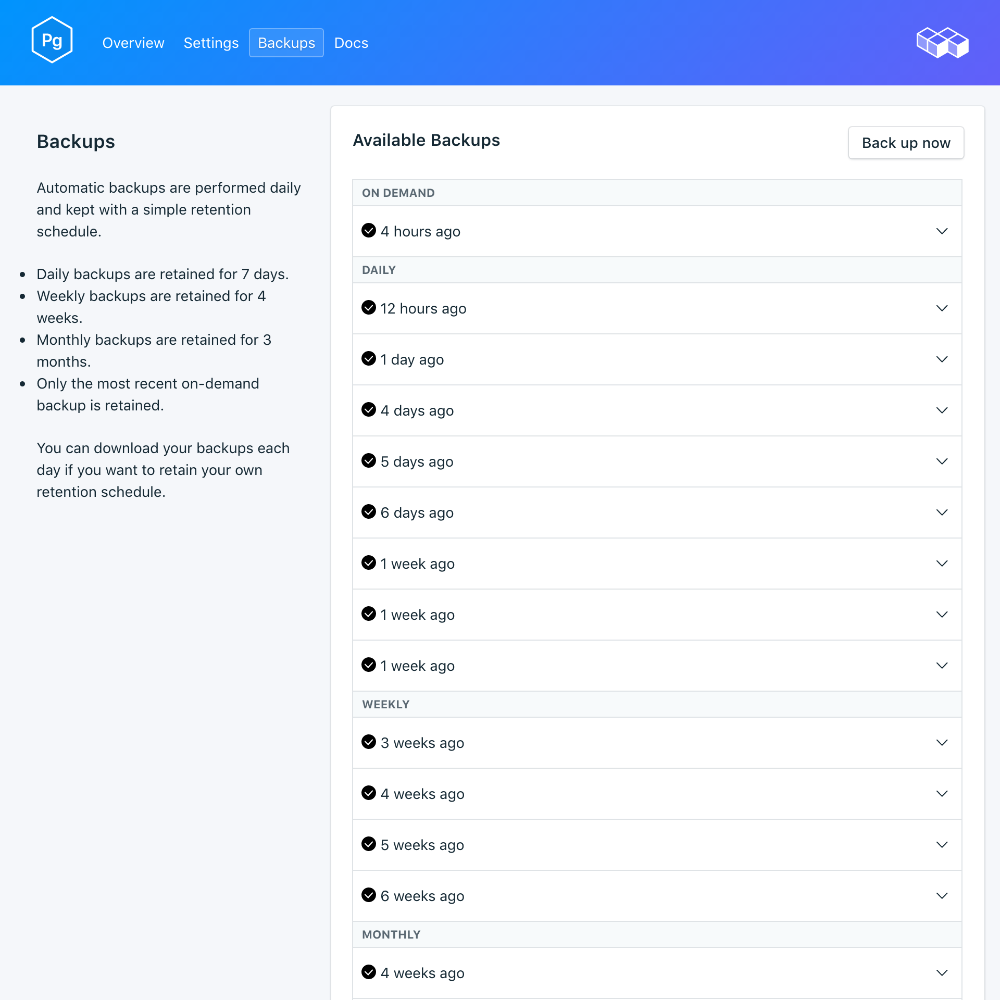
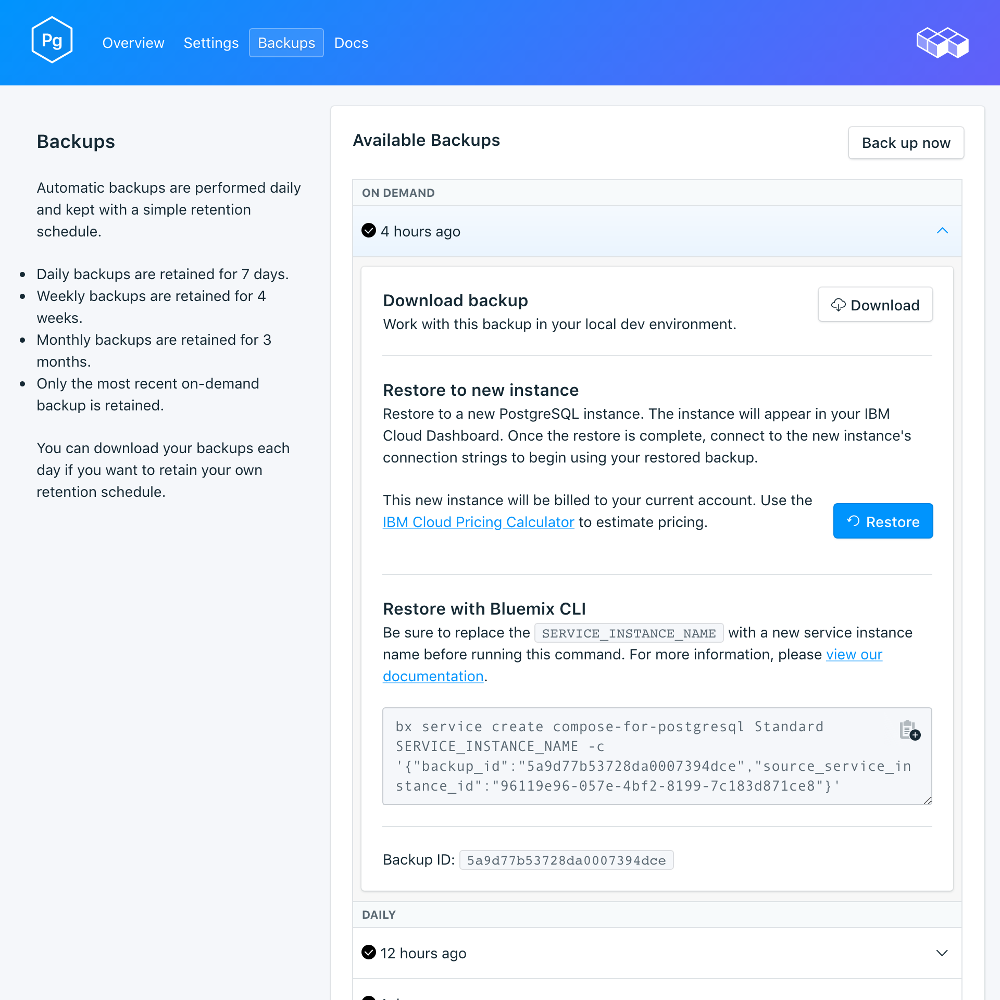

---

copyright:
  years: 2017
lastupdated: "2017-09-07"
---

{:new_window: target="_blank"}
{:shortdesc: .shortdesc}
{:screen: .screen}
{:codeblock: .codeblock}
{:pre: .pre}

# 백업
{: #backups}

서비스 대시보드의 *관리* 페이지에서 백업을 작성하고 다운로드할 수 있습니다. 스케줄된 백업과 수동 백업이 모두 사용 가능합니다.

## 기존 백업 보기

데이터베이스의 일간 백업이 자동으로 스케줄됩니다. 기존 백업을 보려면 서비스 대시보드의 *관리* 페이지로 이동하십시오. 

해당 행을 클릭하여 사용 가능한 백업에 대한 옵션을 펼치십시오.

 

## 요청 시 백업 작성

스케줄된 백업은 물론 수동으로 백업을 작성할 수도 있습니다. 수동 백업을 작성하려면 서비스 대시보드의 *관리* 페이지로 이동하여 *지금 백업*을 클릭하십시오.

## 백업 다운로드

백업을 다운로드하려면 서비스 대시보드의 *관리* 페이지로 이동하여 다운로드할 백업에 해당하는 행에서 *다운로드*를 클릭하십시오. 

## 백업 컨텐츠

{{site.data.keyword.composeForPostgreSQL}} 백업은 실행 중인 서비스 인스턴스에 대해 `pg_basebackup`을 사용합니다. 백업은 클러스터 파일의 2진 사본을 작성하고 데이터 디렉토리의 모든 파일과 모든 테이블스페이스를 포함합니다. WAL(Write Ahead Log) 데이터의 적용 시점으로 데이터베이스를 복원하는 데 사용할 수 있는 WAL 파일도 백업에 포함됩니다.

## 로컬 데이터베이스에 백업 사용

{{site.data.keyword.composeForPostgreSQL}} 백업을 사용하여 데이터베이스의 로컬 사본을 실행할 수 있습니다. 백업의 파일 구조는 여러 백업이 동일한 디렉토리에 저장되도록 허용합니다. 몇 개의 최상위 레벨은 `data --> backup --> *datestamp*`입니다. datestamped 디렉토리 내에서 스냅샷과 WAL 아카이브를 찾을 수 있습니다.

로컬 데이터베이스를 복원하려면 다음을 수행하십시오.

1. 백업을 다운로드하십시오.
2. 백업에는 README 파일 `data/backup/*timestamp*/snapshot/README`가 포함되어 있습니다. 문서 편집기에서 README 파일을 여십시오.
3. PostgreSQL을 다운로드하여 로컬로 설치하십시오. README 파일에 백업이 실행되어야 하는 PostgreSQL의 버전이 표시되어 있습니다.
4. README 파일의 지시사항에 따라 데이터베이스의 로컬 사본을 실행하십시오. `postgres -D conf` 명령을 사용하여 스냅샷 디렉토리 내에서 로컬 PostgreSQL을 시작하십시오. 그런 다음 `psql postgres -U focker`를 실행하여 db에 연결할 수 있습니다.

## 백업 복원

백업을 새 서비스 인스턴스에 복원하려면 단계에 따라 기존 백업을 확인한 후 해당 행을 클릭하여 다운로드할 백업에 대한 옵션을 펼치십시오. **복원** 단추를 클릭하십시오. 복원이 시작되었음을 알리는 메시지가 표시됩니다. 새 서비스 인스턴스가 자동으로 "postgres-restore-[timestamp]"로 이름 지정되고 프로비저닝이 시작될 때 대시보드에 표시됩니다.
