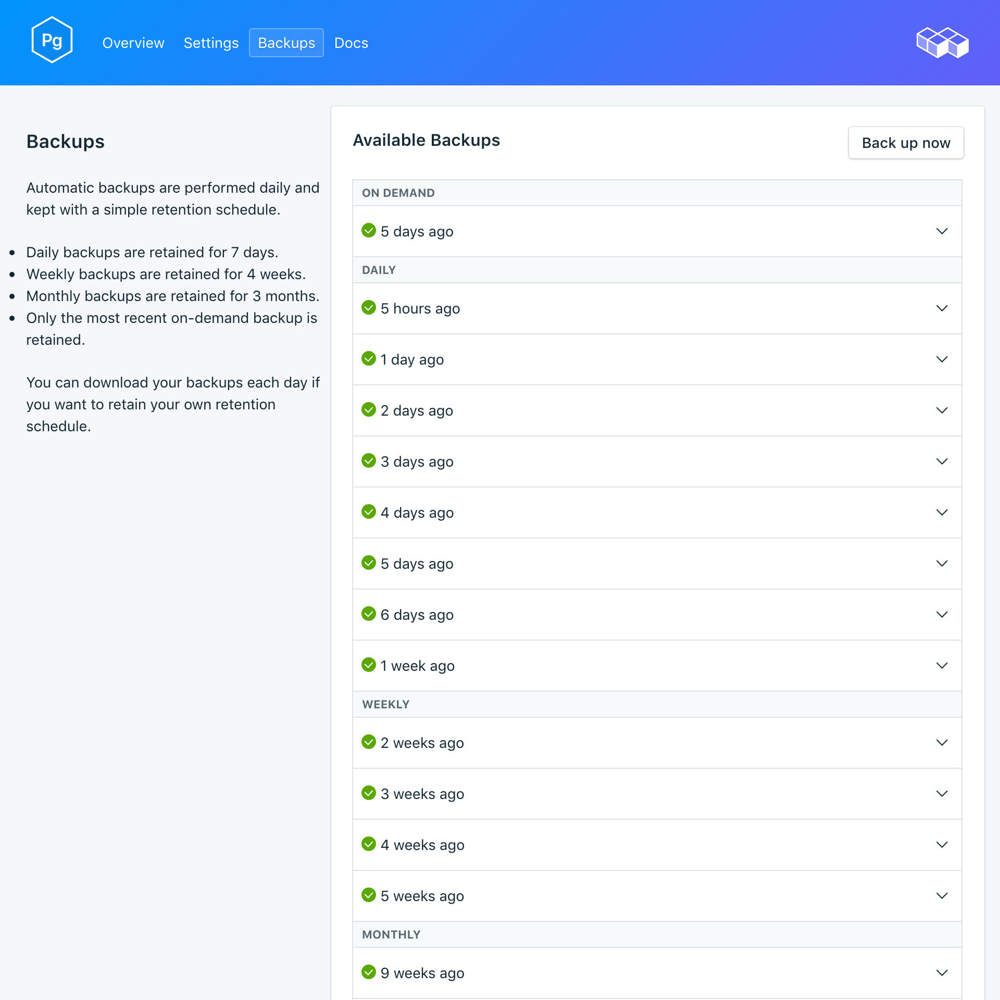

---

copyright:
  years: 2017
lastupdated: "2017-09-07"
---

{:new_window: target="_blank"}
{:shortdesc: .shortdesc}
{:screen: .screen}
{:codeblock: .codeblock}
{:pre: .pre}

# Backups
{: #backups}

É possível criar e fazer download de backups na página *Gerenciar* de seu painel de serviço. Ambos os backups, planejado e manual, estão disponíveis.

## Visualizando backups existentes

Os backups diários de seu banco de dados são planejados automaticamente. Para visualizar seus backups existentes, navegue para a página *Gerenciar* de seu painel de serviço. 

Clique na linha correspondente para expandir as opções para qualquer backup disponível.

 

## Criando um backup sob demanda

Além de backups planejados, é possível criar um backup manualmente. Para criar um backup manual, navegue para a página *Gerenciar* de seu painel de serviço e clique em *Fazer backup agora*.

## Fazendo download de um backup

Para fazer download de um backup, navegue para a página *Gerenciar* de seu painel de serviço e clique em *Fazer download* na linha correspondente para o backup que você deseja fazer download.

## Conteúdos de backup

Os backups do {{site.data.keyword.composeForPostgreSQL}} usam `pg_basebackup` em sua instância de serviço em execução. O backup faz uma cópia binária dos arquivos de cluster e inclui todos os arquivos no diretório de dados e todos os espaços de tabela. O backup também inclui o arquivo WAL (write ahead log), que é possível usar para restaurar um banco de dados para um ponto de tempo coberto pelos dados WAL.

## Usando um backup com um banco de dados local

É possível usar o backup do {{site.data.keyword.composeForPostgreSQL}} para executar uma cópia local de seu banco de dados. A estrutura do arquivo do backup permite que múltiplos backups sejam armazenados no mesmo diretório; alguns níveis principais são `data --> backup --> *datestamp*`. Dentro do diretório com registro de data, você localizará a captura instantânea e o archive WAL.

Para restaurar para um banco de dados local:

1. Faça download de um backup
2. O backup inclui um arquivo LEIA-ME: `data/backup/*timestamp*/snapshot/README`. Abra o arquivo LEIA-ME em um editor de texto.
3. Faça download e instale o PostgreSQL localmente. O arquivo LEIA-ME indica a versão do PostgreSQL com a qual o backup deve ser executado.
4. Siga as instruções no arquivo LEIA-ME para executar uma cópia local de seu banco de dados. Inicie o PostgreSQL local dentro do diretório de captura instantânea com o comando `postgres -D conf`. É possível então se conectar ao db executando: `psql postgres -U focker`.

## Restaurando um backup

Para restaurar um backup para uma nova instância de serviço, siga as etapas para visualizar os backups existentes, em seguida, clique na linha correspondente para expandir as opções para o backup que você deseja fazer download. Clique no botão **Restaurar**. Uma mensagem é exibida para permitir que você saiba que uma restauração foi iniciada. A nova instância de serviço será nomeada automaticamente "postgres-restore-[timestamp]" e aparecerá em seu painel quando o fornecimento iniciar.
