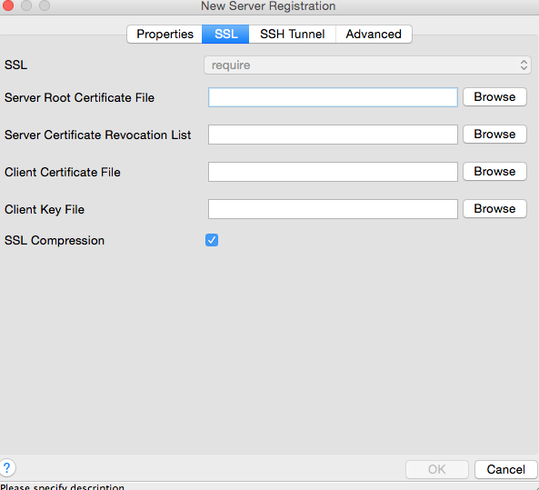

---

copyright:
  years: 2017
lastupdated: "2017-06-07"
---

{:new_window: target="_blank"}
{:shortdesc: .shortdesc}
{:screen: .screen}
{:codeblock: .codeblock}
{:pre: .pre}

# 连接外部应用程序
{: #connecting-external-app}

有两种方法可将外部应用程序连接到 {{site.data.keyword.composeForPostgreSQL_full}}：

- **连接字符串**可由某些客户机库使用，并包含其他库连接所需的所有信息。

- **命令行**是一个预先格式化的命令，它将使用正确的参数来调用 `psql`。

您将在 {{site.data.keyword.composeForPostgreSQL}} 服务的*概述*页面上找到这两项。

## 使用语言驱动程序进行连接

Postgres 具有大量语言驱动程序。此表涵盖一些最常见的驱动程序。

语言|示例
----------|-----------
PHP|[pgsql](http://php.net/manual/en/pgsql.examples-basic.php)
Ruby|[ruby-pg](https://bitbucket.org/ged/ruby-pg/wiki/Home)
Ruby on Rails|[Rails 指南](http://edgeguides.rubyonrails.org/configuring.html#configuring-a-postgresql-database)
Python|[Psycopg2](https://wiki.postgresql.org/wiki/Psycopg2_Tutorial)
C#|[ODBC](https://wiki.postgresql.org/wiki/Using_Microsoft_.NET_with_the_PostgreSQL_Database_Server_via_ODBC)
Go|[pq](https://godoc.org/github.com/lib/pq)
Node|[node-postgres](https://github.com/brianc/node-postgres/wiki/Example)

## 使用命令行进行连接

**psql** 是用于连接到 Postgres 的命令行工具。要使用它，需要在本地系统上安装 PostgreSQL 客户机工具。通过安装从 postgresql.org 下载的完整 PostgreSQL，可以安装这些工具（通过您的操作系统软件包或在已安装 brew 的 MacOSX 上，运行 `brew install postgresql`）。   

您可以在 PostgreSQL 文档（[参考](https://www.postgresql.org/docs/current/static/app-psql.html)）以及《Postgres 指南》的简单[简介](http://postgresguide.com/utilities/psql.html)中阅读有关 psql 的更多信息。

您可以从“概述”选项卡中找到需要在 {{site.data.keyword.composeForPostgreSQL}} 实例仪表板中使用的命令行命令。

```
psql "sslmode=require host=bluemix-sandbox-dal-9-portal.6.dblayer.com port=24761 dbname=compose user=admin"
```

当您输入命令时，系统将提示您输入密码，您可在同一选项卡或*服务凭证*中的“连接字符串”信息中找到该密码。

## 使用 pgAdmin3 进行连接

pgAdmin3 是适用于 PostgreSQL 的常用 GUI 客户机。通过以下步骤，以使用 pgAdmin 3 进行连接

1. 从 [https://www.pgadmin.org/](https://www.pgadmin.org/) 为您的操作系统下载并安装 pgAdmin3 版本。
2. 运行 pgAdmin3 并从菜单栏中选择“添加服务器”以创建新连接，从而打开*新建服务器注册*面板。

  

3. 使用 {{site.data.keyword.composeForPostgreSQL}} 服务“概述”页面中的信息填写面板中的字段：

  * **名称**：可以是描述 Postgres 部署的任何内容。为简单起见，请使此名称与 Compose 中使用的名称相同。
  * **主机**：这将来自连接字符串的主机部分。
  * **端口**：这将来自连接字符串的端口部分。
  * **用户名**：这将是您创建的管理员或用户的用户名。
  * **密码**：这将是您创建的管理员（可在“凭证”部分中找到）或用户的密码。

4. 填写完字段后，选择“SSL”选项卡：

  

5. 将 SSL 更改为“必要”。
6. 单击“确定”以保存连接设置并连接到数据库。
