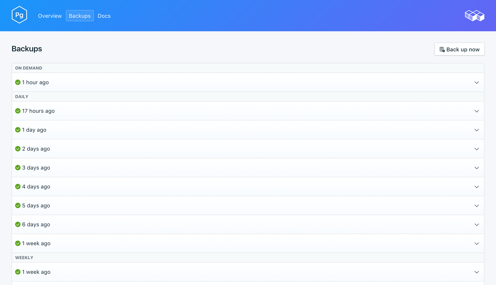
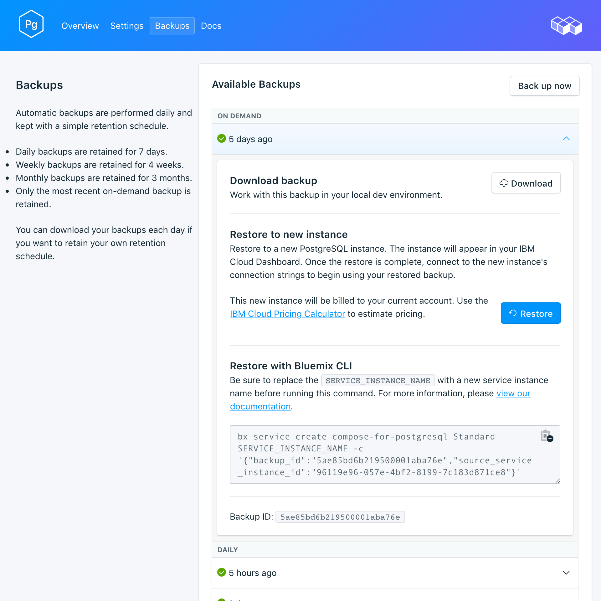

---

copyright:
  years: 2017
lastupdated: "2017-09-07"
---

{:new_window: target="_blank"}
{:shortdesc: .shortdesc}
{:screen: .screen}
{:codeblock: .codeblock}
{:pre: .pre}

# 备份
{: #backups}

您可以从服务仪表板的*管理*页面创建和下载备份。可以使用安排的备份和手动备份。

## 查看现有备份

数据库的每日备份会自动安排。要查看现有备份，请浏览至服务仪表板的*管理*页面。 

单击相应的行以展开任何可用备份的选项。

 

## 随需应变创建备份

除了已安排的备份，您还可以手动创建备份。要创建手动备份，请浏览至服务仪表板的*管理*页面，然后单击*立即备份*。

## 下载备份

要下载备份，请浏览至服务仪表板的*管理*页面，然后单击要下载的备份相应行中的*下载*。

## 备份内容

{{site.data.keyword.composeForPostgreSQL}} 备份对您正在运行的服务实例使用 `pg_basebackup`。该备份会生成集群文件的二进制副本，并包含数据目录和所有表空间中的所有文件。该备份还包含 WAL（预写式日志）文件，可用于将数据库复原到 WAL 数据涵盖的时间点。

## 将备份与本地数据库配合使用

您可以使用 {{site.data.keyword.composeForPostgreSQL}} 备份来运行数据库的本地副本。备份的文件结构允许将多个备份存储在同一个目录中；最上面几个级别是 `data --> backup --> *datestamp*`。在具有日期戳的目录中，您将找到快照和 WAL 归档。

要复原到本地数据库，请执行以下操作：

1. 下载备份
2. 备份包含自述文件：`data/backup/*timestamp*/snapshot/README`。在文本编辑器中打开自述文件。
3. 在本地下载并安装 PostgreSQL。自述文件指示应与备份一起运行的 PostgreSQL 的版本。
4. 遵循自述文件中的指示信息来运行数据库的本地副本。使用 `postgres -D conf` 命令在快照目录中启动本地 PostgreSQL。然后，可以通过运行以下命令连接到数据库：`psql postgres -U focker`。

## 复原备份

要将备份复原到新服务实例，请执行以下步骤以查看现有备份，然后单击相应的行以展开要下载的备份的选项。单击**复原**按钮。此时将显示一条消息，通知您已启动复原。新服务实例将自动命名为“postgres-restore-[timestamp]”，并在供应启动时显示在仪表板上。
